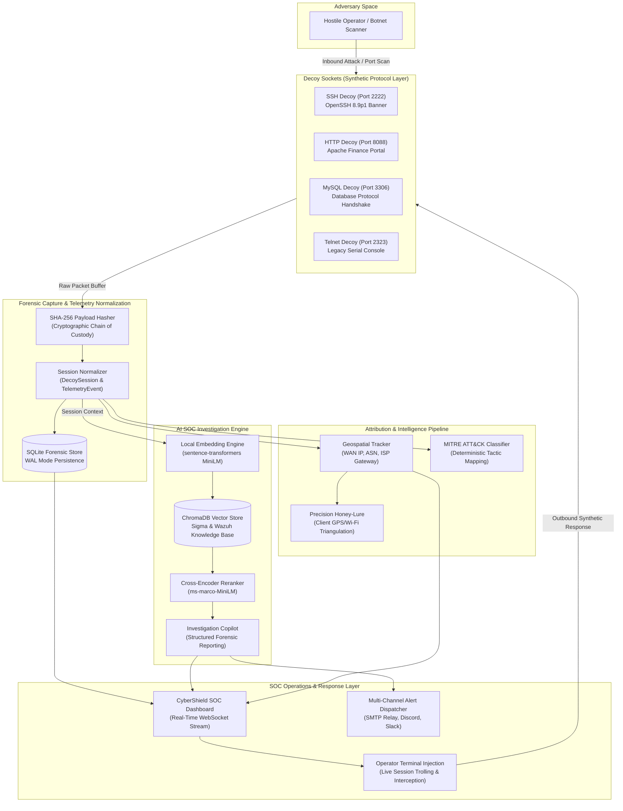
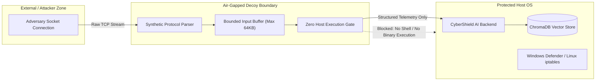

# CyberShield AI: Autonomous Cyber-Deception Grid & AI SOC Platform

[](https://www.python.org/)
[](https://fastapi.tiangolo.com/)
[](https://www.trychroma.com/)
[](https://attack.mitre.org/)
[](https://leafletjs.com/)
[](LICENSE)

CyberShield AI is an autonomous cyber-deception and threat intelligence platform. It integrates a multi-service decoy honeypot grid with an on-premise Retrieval-Augmented Generation (RAG) SOC investigation engine. 

Instead of passive network logging or ungrounded blocking, CyberShield AI actively entangles adversaries in high-fidelity decoy services, captures raw session telemetry with cryptographic integrity, correlates actions against MITRE ATT&CK techniques in real time, and provides an interactive operator command console with automated incident alerting.

---

## System Architecture

CyberShield AI enforces a closed-loop intelligence cycle: **Deceive &rarr; Capture &rarr; Correlate &rarr; Investigate &rarr; Neutralize**.



---

## Zero-Egress Sandboxing & Trust Boundaries

The platform operates on a zero-trust, zero-egress security model to guarantee production isolation:



* **No Shell Execution**: Attacker inputs are recorded as passive byte buffers. Commands entered into the SSH or Telnet decoys are processed synthetically without spawning OS sub-processes or bash instances.
* **Bounded Input Buffering**: Inbound payloads are strictly clamped to prevent buffer overflow or denial-of-service memory exhaustion.
* **Deterministic Isolation**: Attacker connections can be contained directly in the runtime table without silently modifying host firewall rules.

---

## Core Platform Capabilities

### 1. Multi-Port Synthetic Deception Grid
* **OpenSSH Emulation (Port 2222)**: Responds with authentic OpenSSH 8.9p1 banners, capturing credential-stuffing dictionaries and automated botnet probes.
* **Web Operations Portal (Port 8088)**: Presents an interactive corporate finance interface designed to trap SQL injection, directory traversal, and unauthorized authentication attempts.
* **Database Sensor (Port 3306)**: Emulates an internal corporate database cluster, capturing unauthorized SQL reconnaissance queries.
* **Legacy Console (Port 2323)**: Emulates an unhardened serial appliance, attracting automated Mirai-variant IoT scanners.

### 2. On-Premise Vector RAG Investigation Copilot
* **Zero Cloud Leakage**: Uses local `sentence-transformers/all-MiniLM-L6-v2` embeddings stored inside an embedded ChromaDB instance. Threat signatures remain entirely on-premise.
* **Knowledge Base Ingestion**: Grounded in Sigma detection rules, Wazuh endpoint signatures, and enterprise MITRE ATT&CK catalogs.
* **Structured Triage Reports**: Automatically produces threat rationale, calculated confidence scores, mapped MITRE technique codes, and concrete containment recommendations.

### 3. Geospatial Attribution & ISP Routing Intelligence
* **WAN IP & BGP ASN Tracking**: Automatically resolves adversary public WAN IPs, routing Autonomous System Numbers, and organizational ISP metadata.
* **ISP Gateway Routing Radius**: Visualizes adversary locations on a Leaflet OpenStreetMap view with calibrated 12km routing uncertainty circles.
* **HTML5 Precision Honey-Lure**: Leverages browser-level Wi-Fi and GPS triangulation when adversaries interact with decoy web assets, obtaining high-accuracy physical coordinates.

### 4. Interactive Operator Terminal Injection
* **Live Session Intervention**: SOC operators can select any active adversary connection and inject custom terminal responses directly into the attacker's console session in real time.
* **Deception Control**: Misleads adversaries with fictional server errors, delayed prompts, or custom forensic traps while extracting attacker intent.

### 5. Multi-Channel Security Alerter
* **Automated Dispatching**: Evaluates incident severity against configurable risk thresholds.
* **Transport Support**: Dispatches formatted HTML incident dossiers via SMTP relay, Discord webhooks, and Slack channels.

---

## Technology Stack

| Layer | Component | Technology | Role |
| :--- | :--- | :--- | :--- |
| **Decoy Engine** | Network Sockets | Python `socket`, `threading` | Multi-port asynchronous TCP listener runtime |
| **Persistence** | Forensic Store | SQLite (WAL Mode) | Cryptographically hashed incident persistence |
| **AI Investigation** | Vector Database | ChromaDB | Local high-density threat signature vector index |
| **AI Investigation** | NLP Embeddings | `sentence-transformers` | Zero-egress semantic threat representation |
| **AI Investigation** | Reranker | `ms-marco-MiniLM-L-6-v2` | Cross-encoder contextual relevance ranking |
| **Backend API** | REST & WebSockets | FastAPI, Uvicorn | Real-time sensor state and dashboard endpoints |
| **Dashboard** | Visualization | Vanilla HTML5, CSS3, JS | Low-latency SOC command center interface |
| **Geospatial** | World Mapping | Leaflet.js, OpenStreetMap | Interactive adversary geographic tracking |

---

## Quick Start Guide

### Prerequisites
* Python 3.10, 3.11, or 3.12
* Git

### Installation

1. **Clone the repository**:
   ```bash
   git clone https://github.com/harkirat-data/CyberShield-AI-Hackathon.git
   cd CyberShield-AI-Hackathon
   ```

2. **Initialize Python Virtual Environment**:
   ```bash
   python -m venv .venv
   # Windows:
   .venv\Scripts\activate
   # Linux / macOS:
   source .venv/bin/activate
   ```

3. **Install Dependencies**:
   ```bash
   pip install -e .
   ```

4. **Configure Environment Variables**:
   Copy the example environment template:
   ```bash
   cp .env.example .env
   ```
   Configure your local settings in `.env`:
   ```dotenv
   HONEYPOT_BIND_HOST=0.0.0.0
   HONEYPOT_AUTOSTART=true
   SMTP_HOST=smtp.gmail.com
   SMTP_PORT=587
   SMTP_USERNAME=your-account@gmail.com
   SMTP_PASSWORD=your-app-password
   ```

5. **Launch the Unified Platform**:
   ```bash
   python main.py
   ```

6. **Access the SOC Command Center**:
   Open your browser to:
   ```
   http://127.0.0.1:8000
   ```

---

## Repository Structure

```text
CyberShield_AI/
├── Ai/
│   ├── agents/            # Detection, MITRE mapping, and alerting agents
│   ├── backend/           # FastAPI REST endpoints and WebSocket handlers
│   ├── intel/             # BGP ASN and geospatial threat attribution
│   ├── rag/               # ChromaDB vector store, embeddings, and RAG pipeline
│   ├── orchestrator.py    # Central incident investigation coordinator
│   └── schema.py          # Unified data contracts and event models
├── canary/                # Canary tokens and credential tripwire manager
├── collector/             # Host event log collectors (Windows & Linux)
├── dashboard/             # SOC Command Center frontend (HTML, CSS, JS)
├── deploy/                # Deployment configurations and isolation rules
├── docs/                  # Architecture specifications and technical playbooks
├── honeypot/              # Multi-port decoy engine, socket runtime, and models
├── scripts/               # Operational health probes and attack simulators
├── tests/                 # Automated unit and integration test suite
├── main.py                # Unified platform entrypoint
└── pyproject.toml         # Build dependencies and project metadata
```

---

## Verification & Test Suite

The platform includes automated test coverage for telemetry models, database operations, socket lifecycles, and alert dispatchers:

```bash
pytest tests/ -v
```

---

## Hackathon Engineering Team

* **Harkirat Singh** (`harkiratsingh96kk@gmail.com`): System Architecture, Backend Core, AI RAG Pipeline, Multi-Port Decoy Engine & Threat Detection Engine
* **Shaikh Arman** (`shaikharmanmukhtar125@gmail.com`): Frontend Lead, UI/UX Design System, SOC Command Center Layout, Client State Engine & Attack Simulators

---

## License
Distributed under the MIT License. See `LICENSE` for more information.
